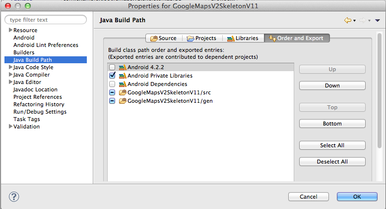

##Part 1 : Setting up the project.

###Introduction

In the first part of this tutorial I will show you can start using Google Maps Android API v2 in your Android application. 
The goal is to create a skeleton project that 

- is capable of displaying a map using the new Google Map for Android API v2
- uses ActionBarSherlock.
- can run on older versions of Android (2.x and up).

I've also created a screencast that covers setting up a skeleton project (not covering ActionBarSherlock).

<iframe width="560" height="315" src="//www.youtube.com/embed/Iz5cfPV200E?rel=0&vq=hd720" frameborder="0"> </iframe>

###Google Maps Android API v2
 
The new Google Maps Android API v2 (available through Google Play Services) is a vast improvement over the original one and comes with many new features. 
Not only does it really stand out from a UI perspective but also on an API level can the new Maps v2 library be considered a "delight" for both end-users and developers.

Before the Google Maps Android API v2 was released, developers were forced to embed a `MapView` component in a special type of Activity called a `MapActivity`. 

When developers created map applications using the MapView component, the maps embedded in these third party applications were not of the same standard as the ones that you found on the Google Maps application. 
Not only were the tiles of much higher quality in the Google Maps application, but subtle differences like auto-orienting street-names and labels that were present in the Google Maps application were not available in the MapView component. So effectivly, developers were left with a lower quality map component.

The `MapView` component also had several limitations. You could use 1 `MapView` component in your application and there was no `Fragment` support.

This has all changes with the new Google Maps Android v2 API.

A quick overview of the features of the new Maps Android API v2:

- Distribution via Google Play Services (no more waiting for Android platform updates to get new functionality)
- Full fragment support (no more MapView, no more single map / app limitation)
- New Map look and feel (new tiles, new gestures, 3D support ....)

In the first part of this series I will show you how to

- setup the skeleton project
- install the library projecs
- setup your map key
- add the map to your application.
- have it run on lower Android SDK levels
- add ActionBarSherlock

### Setting up the skeleton project.

I'm going to be using Eclipse ADT 22 to build the project. We'll start by creating a standard Android project using the project wizard.

Our project is going to use the following Android libraries

- the new Google Maps Android API v2
- ActionBarSherlock library 

Please checkout the resources at the end of the document on how to obtain these projects.

### Installing the library projects.

The first thing we need to do is retrieve the library projects.

- Google Play Services 
- [ActionBarSherlock](http://actionbarsherlock.com/) 

Google Play Services can be downloaded using the android SDK Manager. Navigate to the Extras folder and select Google Play Services.

Google Play Services will be extracted in sdk/extras/google/google_play_services)

**Note:** When importing Library projects into your Eclipse workspace, it's safer to have them somewhere outside of the current workspace before importing them.
Otherwise, you might run into the following error :

	Invalid project description.
	  /Users/ddewaele/Projects/workspace-android/actionbarsherlock overlaps the location of another project: 'actionbarsherlock'

To workaround this problem make sure that before importing the project(s) you simply put them in a location outside of your current workspace, and while importing select the *Copy projects into workspce* option if you want to have them in your workspace folder.

We are going to add the library projects into our Eclipse workspace by importing them. Browse to the Google Play Services path in the SDK and import the project. 
Do the same for ActionBarSherlock.
Once both projects compile in your workspace, you can start adding these library projects as dependencies to our project.

### ADT 22 Android Private Libraries
There's an issue with ADT 22 that it sometimes "forgets" to export the libraries to your APK. You can verify this by going into your build settings and ensuring that the `Android Private Libraries` are checked. This will ensure that whatever is stored in your projects `libs` folder will be properly exported in your APK.

If this is not checked, the Google Play Services library doesn't get included in your APK and you won't be able to run your app.

### Adding the necessary permissions

In order to run Google Maps in your android application, you need to add a set of permissions to your applications manifest.

You need to make sure that the following properties are added. (put them before the starting application tag) :


<!-- Specify the correct minSDK and targetSDK versions. -->
<uses-sdk android:minSdkVersion="8" android:targetSdkVersion="17"/>

<!-- Google Maps related permissions -->
<permission android:name="com.ecs.google.maps.v2.actionbarsherlock.permission.MAPS_RECEIVE" android:protectionLevel="signature"/>
<uses-permission android:name="com.example.mapdemo.permission.MAPS_RECEIVE"/>
 
<!-- Network connectivity permissions -->
<uses-permission android:name="android.permission.ACCESS_NETWORK_STATE"/>
<uses-permission android:name="android.permission.INTERNET"/>
 
<!-- Access Google based webservices -->
<uses-permission android:name="com.google.android.providers.gsf.permission.READ_GSERVICES"/>
 
<!-- External storage for caching. -->
<uses-permission android:name="android.permission.WRITE_EXTERNAL_STORAGE"/>

<!-- My Location -->
<uses-permission android:name="android.permission.ACCESS_COARSE_LOCATION"/>
<uses-permission android:name="android.permission.ACCESS_FINE_LOCATION"/>

<!-- Maps API needs OpenGL ES 2.0. -->
<uses-feature android:glEsVersion="0x00020000" android:required="true"/>   


### Setting up the map key  

Inside the application tag we need to specify our map key. This needs to be done by adding a meta-data element inside the application element:

	<meta-data android:name="com.google.android.maps.v2.API_KEY" android:value="INSERT_YOUR_API_KEY_HERE"/>

The whole proceess of [getting a key is described in great length](https://developers.google.com/maps/documentation/android/start#the_google_maps_api_key) on the Google Android Maps v2 page so I'm not going to discuss it here. I do highly recommend that you read it to obtain your API key.

I've tried to summarize the process in the picture below, showing you the relationships between

- The SHA1 fingerprint of your keystore
- Your application pacakge name
- The API console

### Adding the map fragment

Assuming you've added the permissions and the API key to your application manifest, we can now start by putting a full-screen map into our application.
For the moment we won't be worrying about ActionBarSherlock just yet.

In order to add the map to our application we need to do 2 things.

- Define and add the fragment to the layout
- Implement the fragment

Adding the fragment to a layout is very simple. 

The Google Play Services library provides a simple MapFragment (`com.google.android.gms.maps.MapFragment`) that can be used out of the box.
Note that the `MapFragment` requires the native API Level 11 fragment implementation, so it's only available on devices with API level 11 and higher.
Attempting to run the example below on devices with a lower API level will fail with the following error 

	Caused by: java.lang.ClassNotFoundException: android.view.fragment in loader dalvik.system.PathClassLoader[/data/app/com.ecs.google.maps.v2.actionbarsherlock-2.apk]
		at dalvik.system.PathClassLoader.findClass(PathClassLoader.java:240)
		at java.lang.ClassLoader.loadClass(ClassLoader.java:551)
		at java.lang.ClassLoader.loadClass(ClassLoader.java:511)
		at android.view.LayoutInflater.createView(LayoutInflater.java:471)
		at android.view.LayoutInflater.onCreateView(LayoutInflater.java:549)
		at com.android.internal.policy.impl.PhoneLayoutInflater.onCreateView(PhoneLayoutInflater.java:66)
		at android.view.LayoutInflater.createViewFromTag(LayoutInflater.java:568)
		... 19 more
		
We'll talk about how to run this example on lower API levels in a minute. 

For now, we'll stick with API level 11 and higher by adding the MapFragmnet to the layout like this :


<FrameLayout xmlns:android="http://schemas.android.com/apk/res/android"
	android:id="@+id/root"
	android:layout_width="match_parent"
	android:layout_height="match_parent"
	android:orientation="horizontal" >

<fragment android:id="@+id/map"
		  android:layout_width="match_parent"
		  android:layout_height="match_parent"
		  android:name="com.google.android.gms.maps.MapFragment"/>
</FrameLayout> 


Create the activity that will load up the layout above:


public class SimpleMapActivity extends Activity{
	
	private com.google.android.gms.maps.MapFragment mapFragment;
	private GoogleMap googleMap;

	@Override
	protected void onCreate(Bundle savedInstanceState) {
		super.onCreate(savedInstanceState);
		setContentView(R.layout.map_fragment);
	}

}

	
Note that in order to interact with the map, you need to get a reference to the GoogleMap object. The GoogleMap object can be retrieved via the MapFragment.
In order to get a reference to the MapFragment in an Activity you need to retrieve the FragmentManager using the getFragmentManager call. 
This call is only available on API level 11 and up so you need to have your minSDK set to 11 if you want to run this.


mapFragment = (com.google.android.gms.maps.MapFragment) getFragmentManager().findFragmentById(R.id.map);
googleMap = mapFragment.getMap();
googleMap.setMyLocationEnabled(true);		


### Running on lower API levels

Google also provides a SupportMapFramgment (`com.google.android.gms.maps.SupportMapFragment`) in Google Play services to be used with the Android Support package's backport of fragments. 
In other words, the SupportMapFragment can be used on Android devices running API 10 and lower, as well as Android devices running 11 and higher. 

In order to use the new Google Maps V2 API on older devices we need to do 3 things 

- use a SupportMapFragment instead of a MapFragment in your layout
- use a FragmentActivity instead of an Activity
- use the SupportFragmentManager instead of the FragmentManager in your FragmentActivity

Our layout will now look like this :


<FrameLayout xmlns:android="http://schemas.android.com/apk/res/android"
	android:id="@+id/root"
	android:layout_width="match_parent"
	android:layout_height="match_parent"
	android:orientation="horizontal" >

<fragment
  android:id="@+id/map"
  android:layout_width="match_parent"
  android:layout_height="match_parent"
  class="com.google.android.gms.maps.SupportMapFragment"/>
</FrameLayout> 

  
And our FragmentActivity will look like this :


public class SimpleMapFragmentActivity extends FragmentActivity{

	private SupportMapFragment mapFragment;
	private GoogleMap googleMap;

	@Override
	protected void onCreate(Bundle arg0) {
		super.onCreate(arg0);
		setContentView(R.layout.support_map_fragment);
		
		mapFragment = (SupportMapFragment) getSupportFragmentManager().findFragmentById(R.id.map);
		googleMap = mapFragment.getMap();
		googleMap.setMyLocationEnabled(true);
		
	}
}


Important note : Keep in mind that although the `MapFragment` can run in an `Activity`, the `SupportMapFragment` cannot, and needs to run in a `FragmentActivity`. 

Simply let your activity extend from `FragmentActivity` instead of `Activity` to resolve this. 

If you attempt to run a SupportMapFragment inside an activity, you'll get the following error:

	Caused by: java.lang.ClassCastException: com.google.android.gms.maps.SupportMapFragment cannot be cast to android.app.Fragment

### Adding the ActionBarSherlock.

The point of this article was to show you how you can include the ActionBarSherlock in your app, so lets get started with that.

With ABS 4.3 it couldn't be simpler. Simply have your activity extend SherlockFragmentActivity like this


public class SimpleSherlockFragmentActivity extends SherlockFragmentActivity {

	private SupportMapFragment mapFragment;
	private GoogleMap googleMap;

	@Override
	protected void onCreate(Bundle bundle) {
		super.onCreate(bundle);
		setContentView(R.layout.simple_sherlock_map_fragment);
		
		mapFragment = (SupportMapFragment) getSupportFragmentManager().findFragmentById(R.id.map);
		googleMap = mapFragment.getMap();
		googleMap.setMyLocationEnabled(true);

	}
}


If you want to include a menu simply add this


@Override
public boolean onCreateOptionsMenu(Menu menu) {
  getSupportMenuInflater().inflate(R.menu.main_menu, menu);
  return true;
} 
  
	
If you want to split the actionbar you'll need to add the following option to your activity in the applications manifest.	  

	android:uiOptions="splitActionBarWhenNarrow"

### Older Android version

You'll also notice that despite using the Android Support Library and Action Bar Sherlock that the app doesn't run on older API versions.
The application crashes with the following error :
	
	FATAL EXCEPTION: main
	java.lang.RuntimeException: Unable to start activity ComponentInfo{com.ecs.google.maps.v2.actionbarsherlock/com.ecs.google.maps.v2.actionbarsherlock.MainActivity}: java.lang.IllegalStateException: You must use Theme.Sherlock, Theme.Sherlock.Light, Theme.Sherlock.Light.DarkActionBar, or a derivative.
		at android.app.ActivityThread.performLaunchActivity(ActivityThread.java:1651)
		at android.app.ActivityThread.handleLaunchActivity(ActivityThread.java:1667)
		at android.app.ActivityThread.access$1500(ActivityThread.java:117)
		at android.app.ActivityThread$H.handleMessage(ActivityThread.java:935)
		at android.os.Handler.dispatchMessage(Handler.java:99)
		at android.os.Looper.loop(Looper.java:130)
		at android.app.ActivityThread.main(ActivityThread.java:3687)
		at java.lang.reflect.Method.invokeNative(Native Method)
		at java.lang.reflect.Method.invoke(Method.java:507)
		at com.android.internal.os.ZygoteInit$MethodAndArgsCaller.run(ZygoteInit.java:867)
		at com.android.internal.os.ZygoteInit.main(ZygoteInit.java:625)
		at dalvik.system.NativeStart.main(Native Method)
	Caused by: java.lang.IllegalStateException: You must use Theme.Sherlock, Theme.Sherlock.Light, Theme.Sherlock.Light.DarkActionBar, or a derivative.
		at com.actionbarsherlock.internal.ActionBarSherlockCompat.generateLayout(ActionBarSherlockCompat.java:976)
		at com.actionbarsherlock.internal.ActionBarSherlockCompat.installDecor(ActionBarSherlockCompat.java:902)
		at com.actionbarsherlock.internal.ActionBarSherlockCompat.setContentView(ActionBarSherlockCompat.java:836)
		at com.actionbarsherlock.app.SherlockFragmentActivity.setContentView(SherlockFragmentActivity.java:262)
		at com.ecs.google.maps.v2.actionbarsherlock.MainActivity.onCreate(MainActivity.java:25)
		at android.app.Instrumentation.callActivityOnCreate(Instrumentation.java:1047)
		at android.app.ActivityThread.performLaunchActivity(ActivityThread.java:1615)
		... 11 more

Notice the following in the manifest


<application
	android:allowBackup="true"
	android:icon="@drawable/ic_launcher"
	android:label="@string/app_name"
	android:theme="@style/AppTheme" >
      
        
This can be easily fixed by using the Theme.Sherlock in our application.


<application
	android:allowBackup="true"
	android:icon="@drawable/ic_launcher"
	android:label="@string/app_name"
	android:theme="@style/Theme.Sherlock">        

   
Or even better by specifying your application style in the styles.xml file

	
	<style name="AppTheme" parent="Theme.Sherlock.Light"/>

	
And using it in your application manifest like this:


    <application
        android:allowBackup="true"
        android:icon="@drawable/ic_launcher"
        android:label="@string/app_name"
        android:theme="@style/AppTheme" >
 
	
        
## Application screenshots

### Android 2.3.3

#### Gingerbread simple map (without menu)

#### Gingerbread simple map (with menu)

### Android 4.2.3

#### ICS/Jelly Bean simple map (without menu)

#### ICS/Jelly Bean simple map (with menu)

As you can see, on my Galaxy Nexus I don't have a hardware menu button, so as per Google guidelines, the menu overflow icon (3 dots is shown).

##Debugging issues

Logcat is pretty clear 

	07-06 13:14:46.722: E/Google Maps Android API(28279): Failed to load map. Error contacting Google servers. This is probably an authentication issue (but could be due to network errors).

        
## Resources

- [Google Maps Android API v2](https://developers.google.com/maps/documentation/android/)
- [ActionBarSherlock](http://actionbarsherlock.com/)
- Google Play Services Map Samples (included in the SDK)
 
